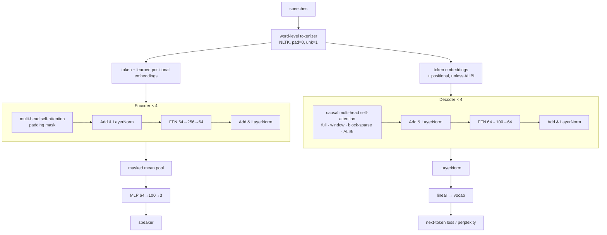
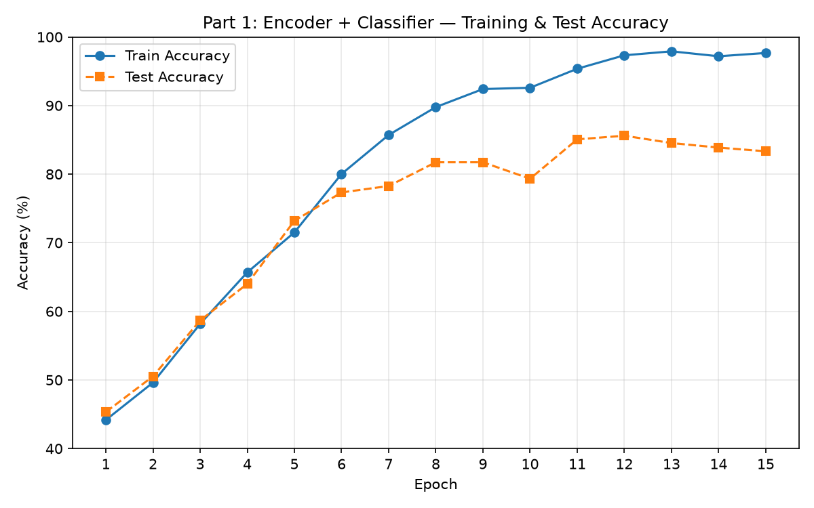
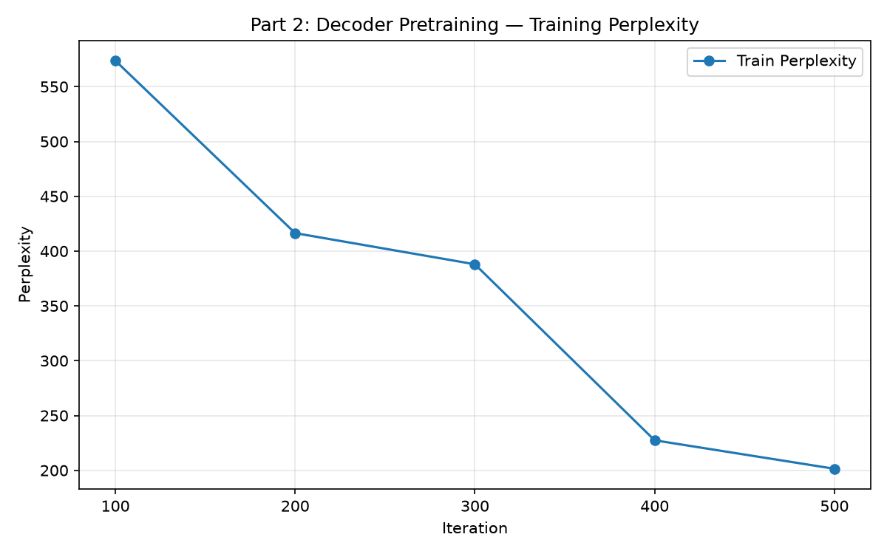
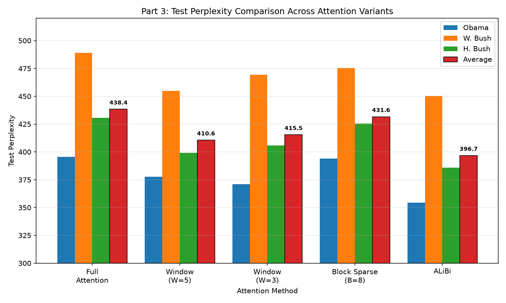
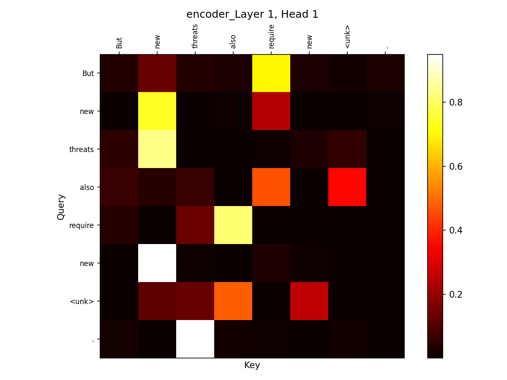
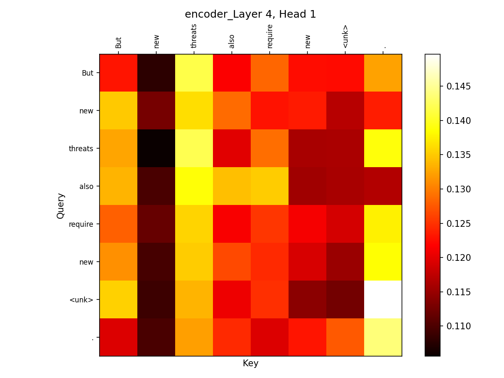
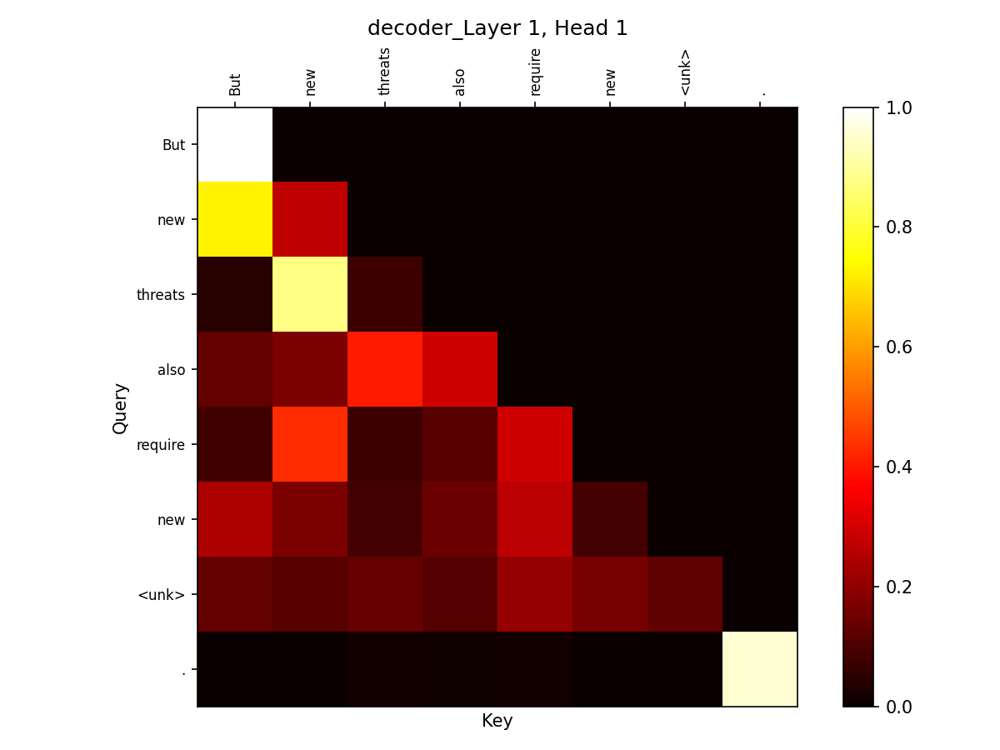
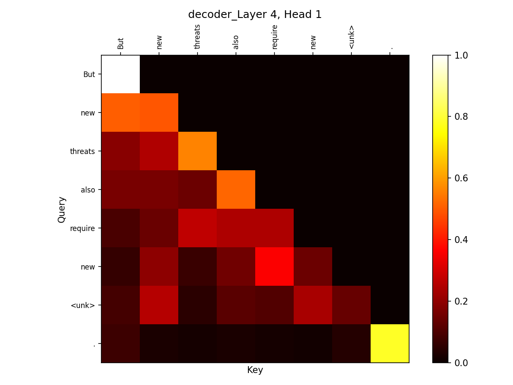

# Transformer Encoder–Decoder from Scratch

A Transformer encoder and a GPT-style decoder written from scratch in PyTorch, without `nn.Transformer` or `nn.MultiheadAttention`. The encoder classifies which politician gave a speech; the decoder is a language model trained on political speeches. The decoder is also used to compare attention variants: sliding-window, block-sparse and ALiBi.


## Overview

The project implements the core parts of a Transformer by hand:

- scaled dot-product multi-head attention
- causal masking
- position-wise feed-forward layers
- residual connections and LayerNorm
- learned positional embeddings

These pieces are used for two tasks on a corpus of US presidential speeches (Obama, George W. Bush, George H. W. Bush):

1. **Speaker classification:** an encoder plus a feed-forward classifier predicts which of the three politicians said a speech segment.
2. **Autoregressive language modeling:** a GPT-like decoder trained on next-token prediction and evaluated by perplexity on held-out speeches from each politician.

On top of the full-attention decoder, the project tests **three changes to attention**: local sliding-window attention, blockwise sparse attention and ALiBi relative-position biases. Each variant changes only the attention pattern and keeps exactly the same parameter count, so the comparisons are controlled. It was built for UCSD CSE 256 (Statistical NLP), Winter 2026.

## Highlights

- **Attention written from scratch** (`transformer.py`):
  - separate Q/K/V/O projections, head split and merge
  - softmax(QKᵀ/√dₖ)·V
  - every layer returns its attention maps so they can be inspected
- **Encoder for classification**:
  - 4 layers, 2 heads, d_model = 64, d_ff = 256
  - post-LN residual blocks with learned positional embeddings
  - padding-aware mean pooling (pad tokens are masked out of the average)
  - a 64 → 100 → 3 MLP classifier trained jointly with the encoder
- **GPT-style decoder**:
  - causal self-attention through a precomputed upper-triangular mask
  - 4 layers and a final LayerNorm before the LM head
  - cross-entropy loss computed inside the model
  - perplexity = exp(mean loss)
- **Attention variants as composable masks and biases** in a single `CausalMultiHeadSelfAttention` module:
  - **Sliding window (W):** masks keys more than W positions in the past
  - **Block sparse (B):** each token attends only within its own block and the block before it, intersected with the causal mask
  - **ALiBi:** non-learned per-head linear distance penalties, with geometric slopes 2^(−8h/H); the positional embeddings are bypassed
- **Correctness checks** (`utilities.py`):
  - attention rows must sum to 1
  - for the decoder, every upper-triangular entry must be zero
  - per-layer, per-head heatmaps are saved for inspection
- **Reproducible CLI** (`main.py`): a single entry point with a fixed seed (42) that runs each experiment and prints a comparison table.

## How it works



All variants share one boolean mask, built once from the token distance `i − j`:

| Variant | What it masks or adds |
|---|---|
| Causal (all variants) | masks `j > i` |
| Sliding window | also masks `i − j > W` |
| Block sparse | also masks keys outside the same or previous block (`i // B`) |
| ALiBi | adds `−slope_h · (i − j)` to the scores before masking |

## Results

All numbers come from the project report (`SergiMarsol_PA2_CSE256.pdf`) and from the logged values in `plot_scripts/`. Setup: seed 42, d_model = 64, 2 heads, 4 layers, context 32, batch size 16, Adam with lr 1e-3.

### Speaker classification (encoder + classifier, 15 epochs)

The encoder has 857,208 parameters and the classifier has 6,803.

- **Test accuracy peaks at 85.60% at epoch 12.** Train accuracy at that point is 97.32%.
- Test accuracy then drifts slightly lower (83.33% at epoch 15), which suggests mild overfitting without regularization.



### Decoder language modeling (500 iterations)

The decoder has 864,011 parameters.

- Training perplexity falls from 573.73 at iteration 100 to **201.42 at iteration 500**.
- Test perplexity in the Part 2 run:

| Speaker | Test perplexity |
|---|---|
| Obama | 406.80 |
| W. Bush | 492.74 |
| H. Bush | 432.61 |



### Attention-variant comparison (test perplexity, lower is better)

Every variant has the same 864,011 parameters.

| Configuration | Obama | W. Bush | H. Bush | Avg |
|---|---|---|---|---|
| Full attention (baseline) | 395.51 | 488.96 | 430.65 | 438.37 |
| Sliding window (W=5) | 377.81 | 454.91 | 399.03 | 410.58 |
| Sliding window (W=3) | 371.15 | 469.33 | 405.88 | 415.45 |
| Block sparse (B=8) | 393.90 | 475.48 | 425.53 | 431.64 |
| **ALiBi** | **354.39** | **450.14** | **385.70** | **396.74** |

- **ALiBi is best on all three test sets.** Its average perplexity is 396.74 against 438.37 for full attention.
- The report's explanation: ALiBi down-weights distant tokens gradually instead of masking them outright, so the model favors local context but can still use long-range context.
- Sliding-window attention also helps clearly, which points to locality acting as a regularizer in this low-data setting.
- Block-sparse attention helps only a little, probably because its rigid block boundaries cut off useful context.



### Attention sanity checks

The heatmaps below are for the sentence "But new threats also require new ⟨unk⟩.".

- **Encoder:** layer 1 attention is diffuse. Layer 4 is more structured, with "threats" drawing the most attention.
- **Decoder:** the maps are strictly lower-triangular, which confirms the causal masking is correct.

| Encoder L1 H1 | Encoder L4 H1 |
|---|---|
|  |  |
| **Decoder L1 H1** | **Decoder L4 H1** |
|  |  |

The full write-up is in [`SergiMarsol_PA2_CSE256.pdf`](SergiMarsol_PA2_CSE256.pdf).

## Tech stack

- **Core:** Python and PyTorch (only `nn.Linear`, `nn.Embedding` and `nn.LayerNorm` as building blocks; no built-in Transformer or attention modules)
- **Tokenization:** NLTK `word_tokenize`
- **Plotting:** matplotlib

## Repository structure

```
.
├── main.py                  # CLI entry point: part1 / part2 / part3 experiments
├── transformer.py           # Attention, encoder, classifier, decoder, and attention variants
├── tokenizer.py             # Word-level tokenizer (NLTK) with <pad>/<unk>
├── dataset.py               # Classification and language-modeling datasets
├── utilities.py             # Attention-map sanity checks and heatmap plotting
├── plot_scripts/            # Scripts that regenerate the result figures
├── figures/                 # Result plots and attention heatmaps used in this README
├── speechesdataset/         # Speech segments (classification TSVs, LM train/test text)
└── SergiMarsol_PA2_CSE256.pdf  # Project report
```

## Getting started

```bash
pip install -r requirements.txt
python -c "import nltk; nltk.download('punkt'); nltk.download('punkt_tab')"   # tokenizer models for word_tokenize
```

Run from the repository root, since data paths are relative to it:

```bash
python main.py part1                              # encoder + classifier: per-epoch train/test accuracy, attention maps
python main.py part2                              # decoder LM: train perplexity every 100 iters, test perplexity per speaker
python main.py part3                              # baseline + all variants (window, alibi, block_sparse) + comparison table
python main.py part3 --methods window alibi       # any subset of: window, alibi, block_sparse
```

Training uses CUDA when it is available and the CPU otherwise. The models are small (under 1M parameters), so CPU is fine.

To regenerate the result plots (written to the current directory):

```bash
python plot_scripts/plot_part1.py
python plot_scripts/plot_part2.py
python plot_scripts/plot_part3.py
```

## Acknowledgements

Built by **Sergi Marsol** for UCSD CSE 256 (Statistical Natural Language Processing). The speeches dataset and the general project setup come from the course.

## License

MIT, see [LICENSE](LICENSE). The speeches dataset is included for reproducibility and keeps its original terms.
